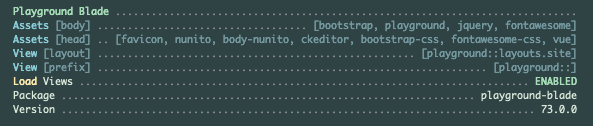

# Playground Blade

[](https://raw.githubusercontent.com/gammamatrix/playground-blade/testing/develop/testdox.txt)
[](tests)
[](.github/workflows/ci.yml#L115)

The Playground Blade package for [Laravel](https://laravel.com/docs/10.x) applications.

This package provides Blade UI handling.

More information is available [on the Playground Blade wiki.](https://github.com/gammamatrix/playground-blade/wiki)

## Installation

You can install the package via composer:

```bash
composer require gammamatrix/playground-blade
```

## Configuration

You can publish the config file with:
```bash
php artisan vendor:publish --provider="GammaMatrix\Playground\Blade\ServiceProvider" --tag="playground-config"
```

See the contents of the published config file: [config/playground-blade.php](config/playground-blade.php)

You can publish the views file with:
```bash
php artisan vendor:publish --provider="GammaMatrix\Playground\Blade\ServiceProvider" --tag="playground-view"
```

### Environment Variables

#### Loading

| env()                         | config()                      |
|-------------------------------|-------------------------------|
| `PLAYGROUND_BLADE_LOAD_VIEWS` | `playground-blade.load.views` |

### UI

| env()                     | config()                  |
|---------------------------|---------------------------|
| `PLAYGROUND_BLADE_LAYOUT` | `playground-blade.layout` |
| `PLAYGROUND_BLADE_VIEW`   | `playground-blade.view`   |

## UI Layouts

NOTE: Using Blade is not required to use Playground, it just an option, such as Vue, React or TypeScript.

The configuration in [config/playground-blade.php](config/playground-blade.php) has a section for frontend assets. If you would like to add more assets, CSS or JavaScript, publish the configuration and add them to the `libs` section.

Assets may be loaded into either head or they will be added to the end of the body.

By default, the following libraries are loaded.

- `favicon`: `/favicon.ico`
- [Nunito](https://fonts.google.com/specimen/Nunito): Loaded from Google Fonts.
- [Bootstrap: 5.3.2](https://getbootstrap.com/docs/5.3/)
- [FontAwesome: 6.4.2](https://fontawesome.com/search?o=r&m=free)
- [Vue 3 - https://unpkg.com/vue@3](https://vuejs.org/)
- `/vendor/playground-blade.js` A small library to be loaded for Blade UI usage. Needs to be published.

Optionally, a page may load:
- [CKEditor 5](https://ckeditor.com/ckeditor-5/) an advanced WYSIWYG editor for forms.

### Assets

If you are using the Playground Blade UI, you can publish the JS assets with:
```bash
php artisan vendor:publish --provider="GammaMatrix\Playground\Blade\ServiceProvider" --tag="playground-js"
```
- These Javascript assets, [resources/js/playground-blade.js](resources/js/playground-blade.js), provide simple helpers for features such as Bootstrap Form Validation and loading CKEditor for textarea elements on forms.


## Testing

```sh
composer test
```

## PHPStan

Tests at level 9 on:
- `config/`
- `resources/views/`
- `src/`
- `tests/Unit/`

```sh
composer analyse
```

## About

Playground Blade provides information in the `artisan about` command.



## Changelog

Please see [CHANGELOG](CHANGELOG.md) for more information on what has changed recently.

## Credits

- [Jeremy Postlethwaite](https://github.com/gammamatrix)

## License

The MIT License (MIT). Please see [License File](LICENSE.md) for more information.
