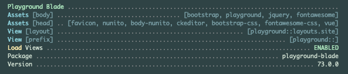

# Playground Blade

[](https://raw.githubusercontent.com/gammamatrix/playground-blade/testing/develop/testdox.txt)
[](tests)
[](.github/workflows/ci.yml#L99)

The Playground Blade package for [Laravel](https://laravel.com/docs/13.x) applications.

This package provides Blade UI handling.

Read more on using [Playground Blade at Read the Docs: Playground Documentation.](https://gammamatrix-playground.readthedocs.io/en/latest/playground/blade.html)

## Installation

You can install the package via composer:

```bash
composer require gammamatrix/playground-blade
```

## Configuration

You can publish the config file with:
```bash
php artisan vendor:publish --provider="Playground\Blade\ServiceProvider" --tag="playground-config"
```

See the contents of the published config file: [config/playground-blade.php](config/playground-blade.php)


Read more on using [Environment Variables at the Read the Docs for Playground Blade.](https://gammamatrix-playground.readthedocs.io/en/develop/playground/blade.html#environment-variables)


## UI Layouts

NOTE: Using Blade is not required to use Playground, it just an option, such as Vue, React or TypeScript.

The configuration in [config/playground-blade.php](config/playground-blade.php) has a section for frontend assets. If you would like to add more assets, CSS or JavaScript, publish the configuration and add them to the `libs` section.

Assets may be loaded into either head or they will be added to the end of the body.

By default, the following libraries are loaded.

- `favicon`: `/favicon.ico`
- [Nunito](https://fonts.google.com/specimen/Nunito): Loaded from Google Fonts.
- [Bootstrap: v5.3.3](https://getbootstrap.com/docs/5.3/)
- [FontAwesome: v6.5.1](https://fontawesome.com/search?o=r&m=free)
- [CKEditor 5: v41.1.0](https://github.com/ckeditor/ckeditor5)
- [Vue 3 - v3.4.21](https://vuejs.org/)
- `/vendor/playground/blade.js` A small library to be loaded for Blade UI usage. Needs to be published.

Optionally, a page may load:
- [CKEditor 5](https://ckeditor.com/ckeditor-5/) an advanced WYSIWYG editor for forms.

### Assets

If you are using the Playground Blade UI, you can publish the JS assets with:
```bash
php artisan vendor:publish --tag playground-blade-js
```
- These Javascript assets, [resources/js/playground-blade.js](resources/js/playground-blade.js), provide simple helpers for features such as Bootstrap Form Validation and loading CKEditor for textarea elements on forms.

Publishes CSS:
```bash
php artisan vendor:publish --tag playground-blade-css
```

You can publish the layouts file with:
```bash
php artisan vendor:publish --tag playground-blade-layouts
```

Components may also be published:
```bash
php artisan vendor:publish --tag playground-blade-components
```

Error pages are available at:
```bash
php artisan vendor:publish --tag playground-blade-errors
```

## Testing

```sh
composer test
```

## Cloc

```sh
composer cloc
```

```
➜  playground-blade git:(develop) ✗ composer cloc
     155 text files.
     150 unique files.                                          
       7 files ignored.

github.com/AlDanial/cloc v 2.08  T=0.07 s (2042.1 files/s, 159911.9 lines/s)
-------------------------------------------------------------------------------
Language                     files          blank        comment           code
-------------------------------------------------------------------------------
Blade                           67            438             50           5077
PHP                             50            557            829           2439
XML                             12              0              7            775
CSS                             10            139            141            461
SVG                              2              2              2            301
YAML                             1              4              0            188
Markdown                         3             51              0            126
JSON                             3              0              0             87
JavaScript                       1              0             35             22
INI                              1              3              0             12
-------------------------------------------------------------------------------
SUM:                           150           1194           1064           9488
-------------------------------------------------------------------------------
```

## PHPStan

Tests at level 9 on:
- `config/`
- `resources/views/`
- `src/`
- `tests/Feature/`
- `tests/Unit/`

```sh
composer analyse
```

## About

Playground Blade provides information in the `artisan about` command.



## Changelog

Please see [CHANGELOG](CHANGELOG.md) for more information on what has changed recently.

## Credits

- [Jeremy Postlethwaite](https://github.com/gammamatrix)

## License

The MIT License (MIT). Please see [License File](LICENSE.md) for more information.
